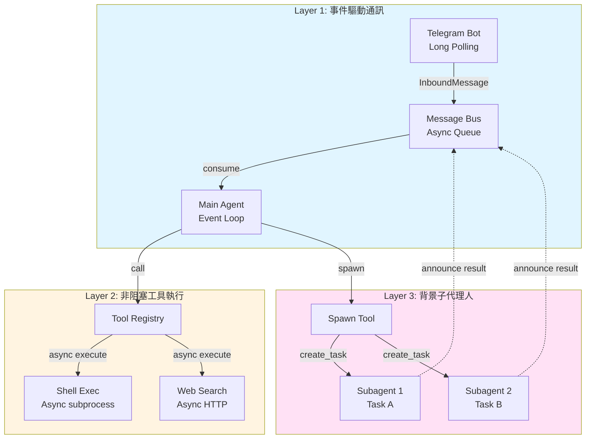
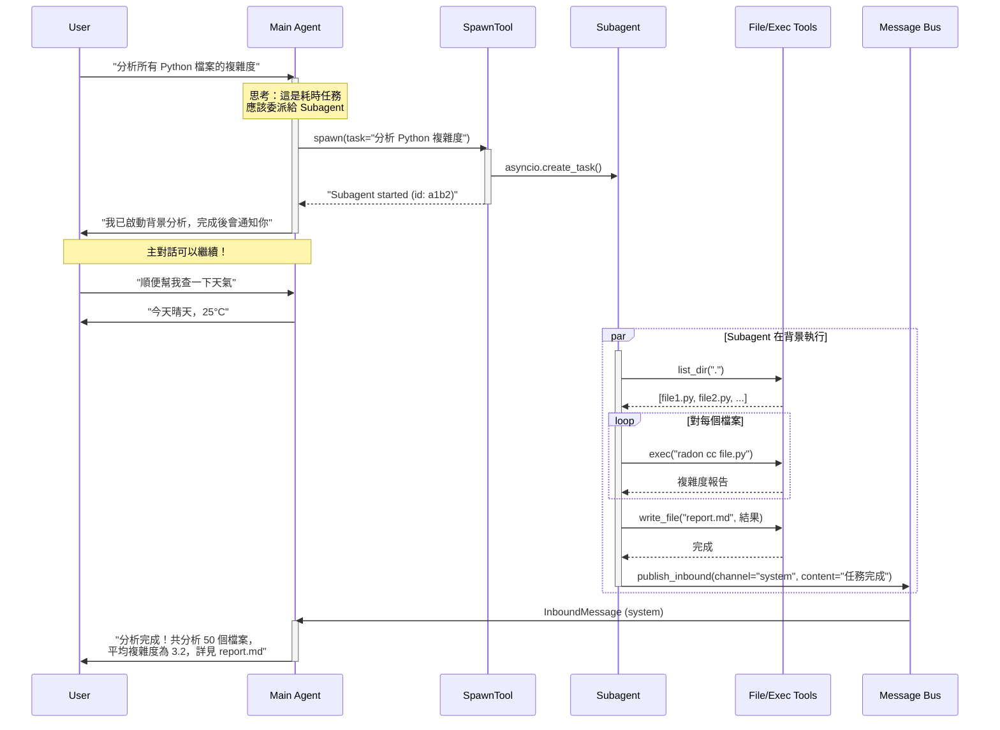

# Nanobot Agentic 控制機制分析 (Agentic Control Mechanisms Analysis)

**日期**: 2026-02-08
**主題**: 從 Agentic AI 控制角度分析 Nanobot 如何支援長時間運算

## 1. 核心問題：為什麼 Agentic AI 需要支援長時間運算？

傳統的 AI 對話系統是「一問一答」的同步模式：
```
User: "幫我分析這 1000 個檔案"
Agent: [等待 30 秒...] "完成！結果是..."
```

但這有幾個問題：
- ❌ **阻塞 (Blocking)**: User 必須等待，無法進行其他對話
- ❌ **超時風險**: 如果任務超過 API timeout，整個請求失敗
- ❌ **資源浪費**: LLM API 的 connection 被長時間佔用

**Agentic AI 的解決方案**：將長時間任務「委派 (Delegate)」給背景執行的 Subagent，主 Agent 立即回應 User，保持對話流暢。

## 2. Nanobot 的三層非同步架構

Nanobot 透過 **三層非同步設計** 實現長時間運算支援：



### Layer 1: 事件驅動通訊 (Event-Driven Communication)
- **Message Bus** 解耦了輸入與處理
- Agent 透過 `asyncio.Queue` 非阻塞地接收訊息
- 即使 Agent 正在處理任務，新訊息也能進入 Queue

### Layer 2: 非阻塞工具執行 (Non-blocking Tool Execution)
- 所有 Tool 都是 `async def execute()`
- Shell 指令透過 `asyncio.subprocess` 執行
- Web 請求透過 `httpx` 的 async client

### Layer 3: 背景子代理人 (Background Subagents)
- 使用 `asyncio.create_task()` 建立真正的背景任務
- Subagent 有獨立的 LLM 呼叫迴圈
- 完成後透過 Bus 通知主 Agent

## 3. 長時間運算的完整流程

讓我們用一個實際例子說明：User 要求「分析專案中所有 Python 檔案的複雜度」



## 4. 關鍵技術細節

### 4.1 Asyncio Task 管理

```python
# SubagentManager.spawn()
bg_task = asyncio.create_task(
    self._run_subagent(task_id, task, label, origin)
)
self._running_tasks[task_id] = bg_task

# 自動清理
bg_task.add_done_callback(
    lambda _: self._running_tasks.pop(task_id, None)
)
```

**為什麼這樣設計？**
- `create_task()` 立即返回，不會阻塞
- Task 在 Event Loop 中並行執行
- `add_done_callback` 確保資源自動釋放

### 4.2 結果通知機制

```python
# Subagent 完成後
msg = InboundMessage(
    channel="system",  # 特殊 channel
    sender_id="subagent",
    chat_id=f"{origin_channel}:{origin_chat_id}",  # 記錄原始來源
    content=announce_content,
)
await self.bus.publish_inbound(msg)
```

**為什麼用 "system" channel？**
- 主 Agent 的 `_process_message()` 會特別處理 `channel="system"`
- 可以將結果路由回原始對話 (透過 `chat_id`)
- 不會與正常 User 訊息混淆

### 4.3 Subagent 的限制設計

```python
# Subagent 的 Tool Registry (沒有 MessageTool 和 SpawnTool)
tools = ToolRegistry()
tools.register(ReadFileTool())
tools.register(WriteFileTool())
tools.register(ExecTool())
tools.register(WebSearchTool())
# 注意：沒有 MessageTool, SpawnTool
```

**為什麼要限制？**
- ❌ 沒有 `MessageTool`: 避免 Subagent 直接打斷 User
- ❌ 沒有 `SpawnTool`: 避免無限遞迴 (Subagent 生 Subagent)
- ✅ 保持簡單：Subagent 專注於單一任務

## 5. 與其他 Agentic 框架的比較

| 特性 | Nanobot | LangChain | AutoGPT |
|------|---------|-----------|---------|
| **非同步架構** | ✅ 原生 asyncio | ⚠️ 部分支援 | ❌ 主要同步 |
| **背景任務** | ✅ Subagent | ❌ 需自行實作 | ⚠️ 有限支援 |
| **事件驅動** | ✅ Message Bus | ❌ 直接呼叫 | ❌ 輪詢模式 |
| **多通道支援** | ✅ Telegram/Discord 等 | ❌ 需額外整合 | ❌ CLI only |
| **長時間任務** | ✅ 原生支援 | ⚠️ 需自行處理 timeout | ⚠️ 容易超時 |

## 6. 實際應用場景

### 場景 1: 程式碼審查
```
User: "審查這個 PR 的所有變更"
Main Agent: spawn(task="審查 PR #123")
→ User 可以繼續問其他問題
→ 5 分鐘後收到完整審查報告
```

### 場景 2: 資料處理
```
User: "分析這個 10GB 的日誌檔"
Main Agent: spawn(task="分析日誌並產生統計")
→ Subagent 在背景執行 grep, awk 等工具
→ 完成後通知 User
```

### 場景 3: 定期任務
```
Cron Job (每天 9:00): "生成昨日報表"
→ 透過 CronService 觸發
→ Agent 處理並發送到 Telegram
→ 不需要 User 手動觸發
```

## 7. 設計哲學總結

Nanobot 的長時間運算支援體現了以下設計哲學：

1. **非阻塞優先 (Non-blocking First)**: 所有 I/O 操作都是 async
2. **解耦設計 (Decoupling)**: Bus 解耦輸入與處理
3. **委派模式 (Delegation)**: 複雜任務委派給 Subagent
4. **事件驅動 (Event-Driven)**: 透過訊息傳遞協調各元件
5. **用戶體驗優先 (UX First)**: 永不阻塞 User 的對話流程

這些設計讓 Nanobot 不僅是一個「聊天機器人」，而是一個真正的「個人助理」，能夠在背景默默工作，同時保持與 User 的即時互動。
