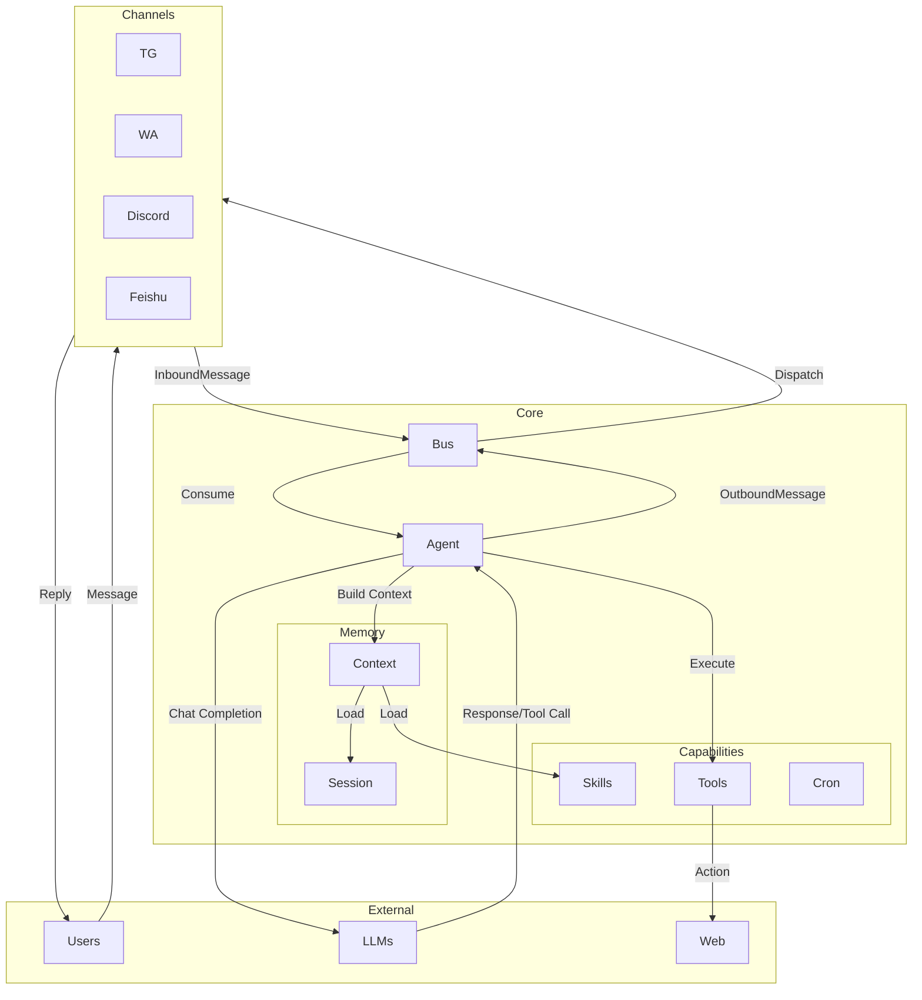

# Nanobot 架構總覽 (Architecture Overview)

**日期**: 2026-02-08
**版本**: Draft v1.0

## 1. 系統簡介 (System Introduction)
Nanobot 是一個輕量級的個人 AI 助理框架 (`Personal AI Assistant Framework`)。設計目標是讓開發者能透過簡單的設定，快速建立具備多種能力 (Skills)、能與多種通訊軟體 (Channels) 串接，並使用各種 LLM 模型 (Providers) 的智慧代理人。

## 2. 核心架構圖 (Core Architecture)

## 3. 關鍵模組說明 (Key Components)

### 3.1 基礎設施 (Infrastructure)
- **CLI (`nanobot/cli`)**: 程式入口。負責初始化設定 (`onboard`)、啟動服務 (`gateway`)、或提供互動式介面 (`agent`).
- **Config (`nanobot/config`)**: 使用 Pydantic 定義設定檔結構。支援從 `~/.nanobot/config.json` 載入設定，包含 Provider 金鑰、Channel 設定、Agent 預設值等。
- **Bus (`nanobot/bus`)**: 一個簡單的異步訊息匯流排 (Async Message Bus)。
  - `Inbound Queue`: 接收來自 Channel 的訊息。
  - `Outbound Queue`: 接收 Agent 產生的回應，並派發給對應的 Channel。
  - **目的**: 解耦 (Decouple) 通訊層與邏輯層，讓 Agent 不需要知道訊息來自哪個平台。

### 3.2 通訊層 (Channels Interface)
位於 `nanobot/channels`。
- **Channel Manager**: 負責啟動所有啟用的 Channel，並監聽 Bus 的 Outbound 訊息進行回覆。
- **Channel Implementations** (e.g., `TelegramChannel`):
  - 負責與外部 API 連線 (Polling 或 Webhook)。
  - 將外部格式轉換為內部標準格式 `InboundMessage`。
  - 將內部標準回應 `OutboundMessage` 轉換為平台特定格式 (如 Telegram HTML)。

### 3.3 智能核心 (Agent Core)
位於 `nanobot/agent`。
- **Agent Loop (`AgentLoop`)**: 核心迴圈。
  - 持續監聽 Inbound 訊息。
  - 協調 Context、LLM 與 Tools 的運作。
  - 實作 "ReAct" 或 "Tool Use" 迴圈：`Thinking -> Action -> Observation -> Thinking`。
- **Context Builder (`ContextBuilder`)**: 負責組裝給 LLM 的 Prompt。
  - 包含：System Identity (身分設定), Bootstrap Files (AGENTS.md, SOUL.md), Conversation History (對話紀錄), Skills (技能描述)。
- **Session Manager (`SessionManager`)**:
  - 管理對話狀態。
  - 將對話紀錄儲存為 JSONL 檔案 (`~/.nanobot/sessions/`)。

### 3.4 供應者與工具 (Providers & Tools)
- **Providers (`nanobot/providers`)**:
  - 透過 `LiteLLM` 封裝，提供統一介面呼叫各種 LLM (OpenRouter, OpenAI, Ollama 等)。
  - 支援自動前綴處理 (如自動加上 `openai/`, `ollama/`) 與參數調整。
- **Skills (`nanobot/skills`)**:
  - 獨特的「文檔即技能」設計。Agent 讀取 `SKILL.md` 來學習如何使用工具或執行任務。
  - 支援動態載入與依賴檢查。
- **Tools (`nanobot/agent/tools`)**:
  - Python 實作的具體功能，如 `ReadFileTool`, `ExecTool`, `WebSearchTool`。

## 4. 運作流程摘要 (Workflow Summary)

1. **啟動**: `nanobot gateway` 啟動，初始化 Config, Bus, Agent Loop 與 Channels。
2. **接收**: User 在 Telegram 發送訊息 -> `TelegramChannel` 接收 -> 轉換為 `InboundMessage` -> 放入 Bus `inbound` queue。
3. **處理**: `AgentLoop` 取出訊息 -> `ContextBuilder` 讀取 Session 與 Skills 組裝 Prompt -> 呼叫 LLM。
4. **決策**: LLM 決定是否呼叫 Tool (如搜尋網路)。
5. **執行**: Agent 執行 Tool -> 將結果回傳 LLM -> LLM 產生最終回應。
6. **回覆**: Agent 產生 `OutboundMessage` -> 放入 Bus `outbound` queue -> `ChannelManager` 派發給 `TelegramChannel` -> 傳送給 User。
