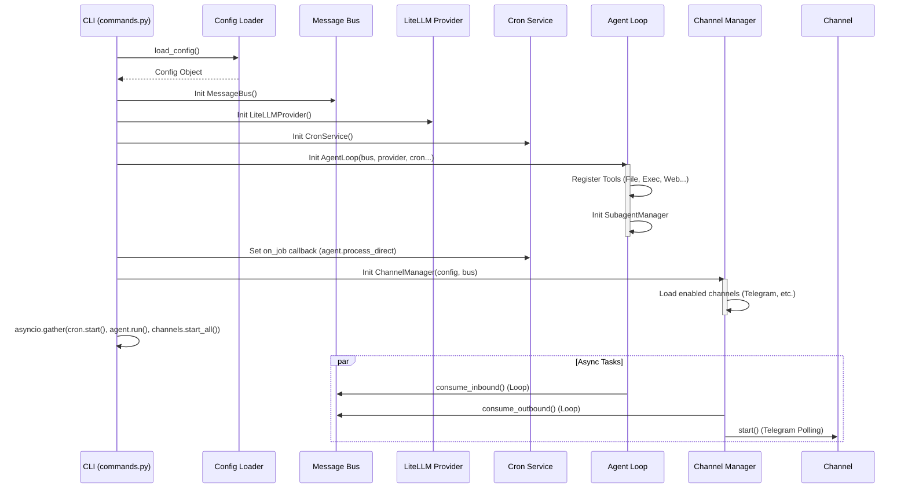
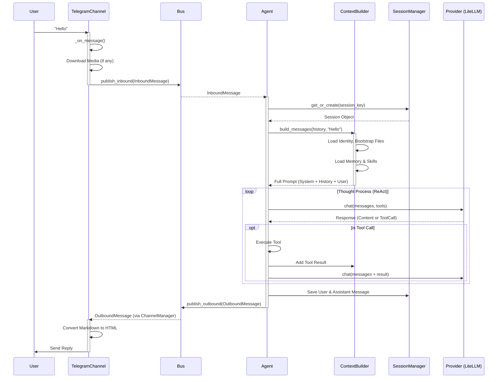

# Nanobot 核心流程分析 (Core Flows Analysis)

**日期**: 2026-02-08
**版本**: Draft v1.0

## 1. 系統啟動流程 (Startup Flow)

當執行 `nanobot gateway` 時，系統會依序初始化各個服務。

## 2. 訊息處理流程 (Message Processing Flow)

當 User 在 Telegram 發送 "Hello" 給機器人時：

## 3. Context 建構流程 (Context Build Flow)

Agent 如何「記得」你是誰，以及它能做什麼？全靠 `ContextBuilder`。

1.  **Identity**: 載入硬編碼的 System Prompt（你是 nanobot...）。
2.  **Bootstrap**: 讀取 `AGENTS.md`, `SOUL.md`, `USER.md` 等核心設定檔。
3.  **Memory**: 讀取 `memory/MEMORY.md` (長期記憶)。
4.  **Skills**:
    - **Always-on Skills**: 直接讀取完整 `SKILL.md` 內容放入 Context。
    - **Other Skills**: 僅放入 XML 摘要 (`<skill><name>...</name></skill>`)。Agent 若需使用，需先呼叫 `read_file` 讀取詳細說明。
5.  **History**: 從 Session 讀取最近 N 則對話紀錄。
6.  **Current Message**: 加上 User 最新的一句話 (含圖片 Base64)。

## 4. 技能使用流程 (Skill Execution Flow)

Nanobot 的技能設計是「文件中定義工具」。

1.  User: "幫我查一下現在的比特幣價格"
2.  Agent:
    - 檢視 Context 中的 `<skills>` 列表，發現 `finance` skill 可能有幫助。
    - (若未載入) Agent 決定讀取 `skills/finance/SKILL.md`。
    - 讀取後，Agent 發現裡面描述了如何使用 `web_search` 工具來查詢價格。
    - Agent 呼叫 `web_search(query="bitcoin price")`。
    - 獲得結果後，Agent 整理並回覆 User。
